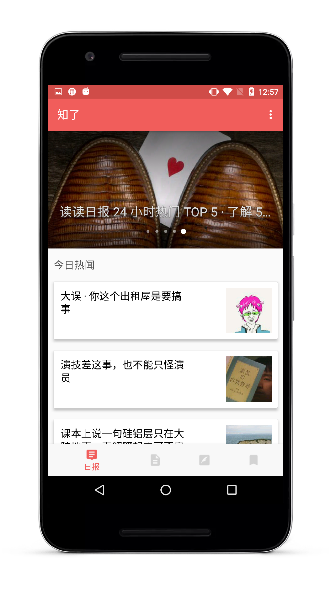
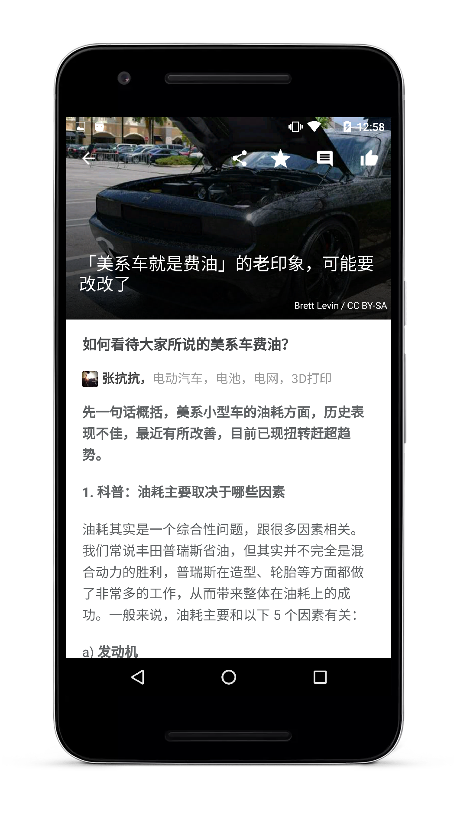
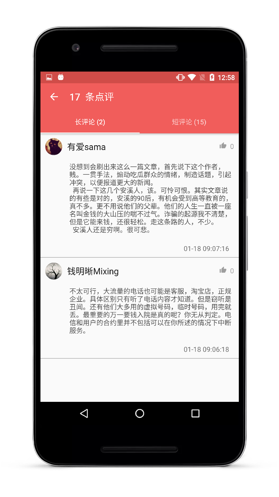
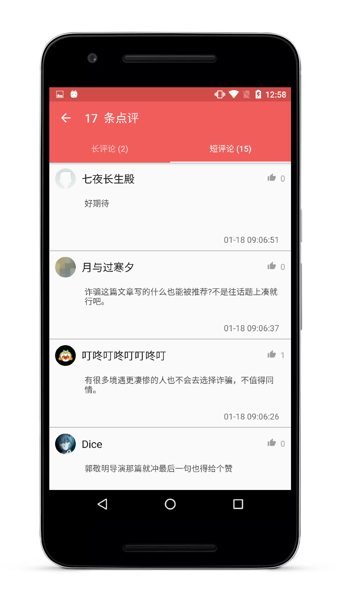
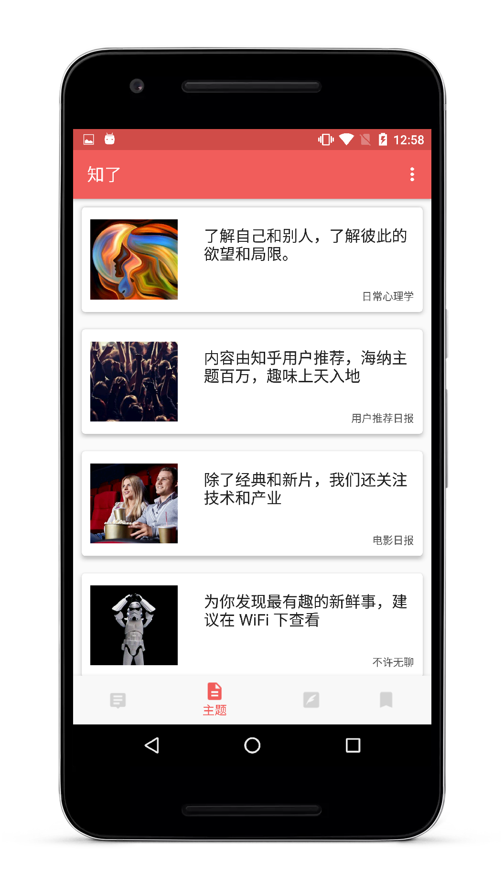
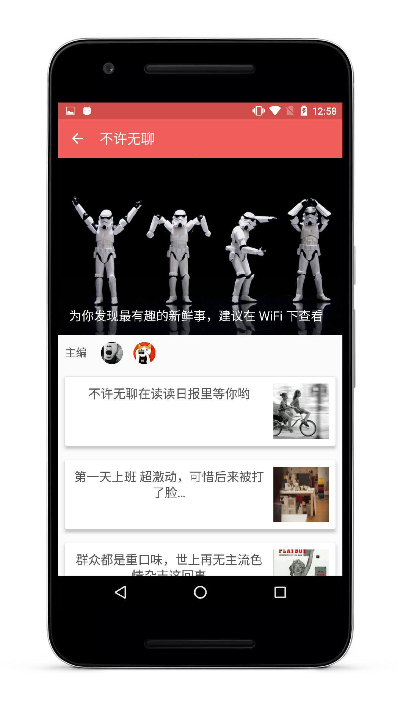
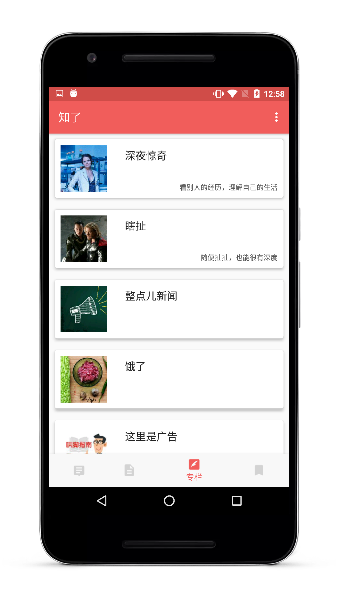
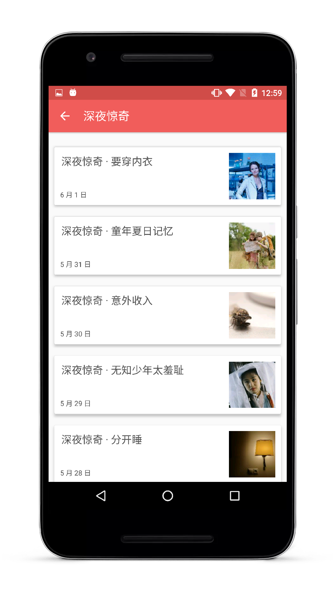
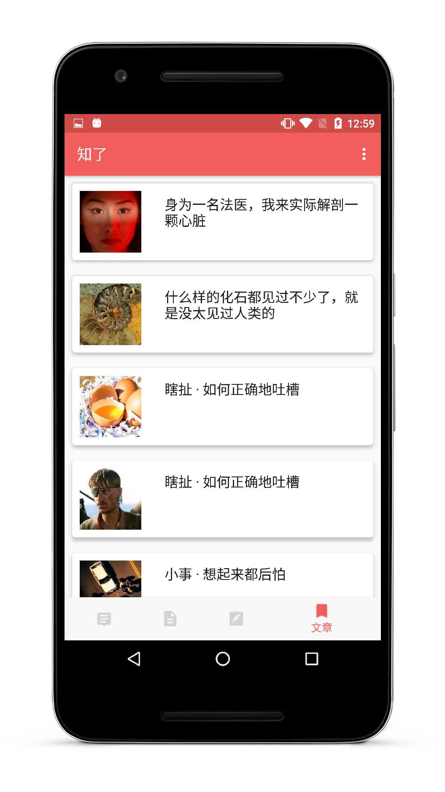
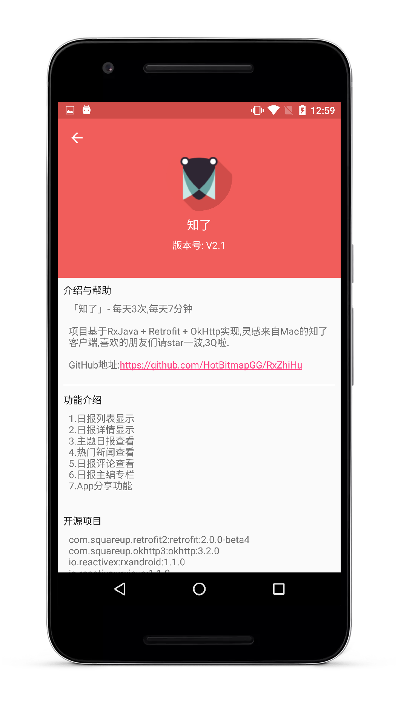

# 知了日报

A pure MaterialDesign style reading App & 一个MaterialDesign风格纯粹阅读的App.

## Tips

* 该项目正在使用MVP进行重构.

## 简介

* 每天3次,每次7分钟,一个纯粹阅读的App.

## 功能介绍

* 1.日报列表显示
* 2.日报详情显示
* 3.主题日报查看
* 4.热门新闻查看
* 5.日报评论查看
* 6.日报主编专栏
* 7.App分享功能

## Apk下载

## 截图

 

 

 

 

 

## 声明

本项目所使用API均来自 知乎日报 API 分析若被告知需停止共享与使用，本人会及时删除此页面与整个项目,请您暸解相关情况，并遵守知乎协议.

## About me

An android developer in Wuhan.

If you want to make friends with me, You can focus on my weibo.

## License

 Copyright 2016 HotBitmapGG

 Licensed under the Apache License, Version 2.0 (the "License"); you may not use this file except in compliance with the License. You may obtain a copy of the License at

 http://www.apache.org/licenses/LICENSE-2.0

 Unless required by applicable law or agreed to in writing, software distributed under the License is distributed on an "AS IS" BASIS, WITHOUT WARRANTIES OR CONDITIONS OF ANY KIND, either express or implied. See the License for the specific language governing permissions and limitations under the License.

